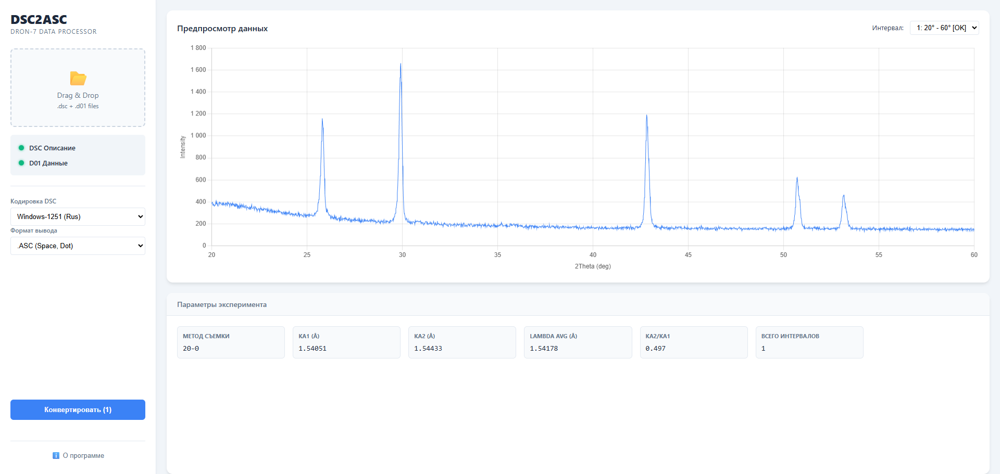

# DSC2ASC

**DSC2ASC** — это современный веб-инструмент для просмотра и конвертации данных рентгеновской дифрактометрии (ДРОН-7). Приложение позволяет преобразовывать бинарные файлы спектров (`.d01`, `.d02`...) в читаемые текстовые форматы (`.asc`, `.csv`) на основе метаданных из файла описания (`.dsc`).

Интерфейс выполнен в стиле "Scientific Dashboard" для удобной работы с большим количеством файлов.

## ✨ Основные возможности

*   **Парсинг метаданных:** Автоматическое чтение параметров съемки (анод, длины волн, геометрия гониометра) из файлов `.dsc`.
*   **Интерактивная визуализация:** Интерактивный предпросмотр спектра (Chart.js) с возможностью выбора интервала съемки.
*   **Корректная математика:** Расчет оси 2Theta производится строго по формуле $Start + i \times Step$, что позволяет корректно обрабатывать аварийно прерванные съемки.
*   **Пакетная обработка:** Автоматическое сопоставление файла описания с множеством файлов данных.
*   **Архивация:** При конвертации нескольких интервалов результат автоматически упаковывается в `.zip`.
*   **Гибкая настройка форматов:**
    *   Выбор кодировки входного файла (Windows-1251, UTF-8, DOS).
    *   Настройка разделителей CSV (для Excel RU/EN).
*   **Drag & Drop:** Удобная загрузка файлов перетаскиванием.
*   **Статус-индикаторы:** Визуальный контроль загрузки DSC и данных файлов.
*   **Приватность:** Все вычисления производятся **локально в браузере** (Client-side), данные не отправляются на сервер.

## 🚀 Установка и запуск

### Требования
- Node.js (рекомендуется LTS версия)
- npm или yarn

### Быстрый старт

1. **Клонируйте репозиторий:**
   ```bash
   git clone https://gitflic.ru/project/i-o-yurev/dsc2asc-js.git
   cd dsc2asc-js
   ```

2. **Установите зависимости:**
   ```bash
   npm install
   ```

3. **Запустите разработку:**
   ```bash
   npm run dev
   ```
   Приложение запустится на http://localhost:5173

4. **Соберите для production:**
   ```bash
   npm run build
   ```
   Собранный проект будет в папке `dist/`

5. **Запустите preview сборки:**
   ```bash
   npm run preview
   ```

### Альтернативные варианты запуска

#### Вариант 1: Локальный сервер (рекомендуется)
Для корректной работы некоторых браузерных API лучше использовать локальный сервер.
Если у вас установлен Python:
```bash
python -m http.server
```
Или расширение "Live Server" для VS Code.

#### Вариант 2: Standalone сборка (для развертывания)
Для создания одного standalone HTML файла:
```bash
npm run build:single
```
Результат будет в `dist-single/` с именем `dsc2asc-js-v1.0.0.html`

> **Примечание:** Прямое открытие исходного `index.html` не поддерживается из-за использования ES6 модулей.

## 📁 Поддерживаемые форматы

### Входные данные
*   **`.dsc`**: Текстовый файл описания съемки (содержит секции `[General]`, `[Intervals]` и др.). Поддерживает старые кодировки (Windows-1251).
*   **`.d01`, `.d02`...**: Бинарные файлы данных (массив чисел `float32`, Little Endian).

### Выходные данные
*   **`.asc`**: Стандартный ASCII формат (разделитель - пробел, десятичная точка).
*   **`.csv` (Standard)**: Разделитель - запятая, десятичная точка.
*   **`.csv` (Excel RU)**: Разделитель - точка с запятой, десятичная запятая.

## 🛠 Технический стек

*   **Vite** - современный сборщик
*   **ES6+ JavaScript** - модульная система, классы, async/await
*   **HTML5 / CSS3** - Grid Layout, CSS Variables, адаптивный дизайн
*   **[Chart.js](https://www.chartjs.org/)** - интерактивная визуализация данных
*   **[JSZip](https://stuk.github.io/jszip/)** - создание ZIP-архивов в браузере

## 🧮 Логика конвертации

Особенность прибора ДРОН-7 заключается в том, что реальное количество точек в файле `.d01` может не соответствовать конечному углу, указанному в `.dsc` (если съемка была остановлена).

**Алгоритм работы DSC2ASC:**
1. Читаем начальный угол (`Start`) и шаг (`Step`) из `.dsc`.
2. Читаем массив интенсивностей ($I$) из бинарного файла `.d01`.
3. Для каждой точки $i$ рассчитываем угол $2\theta$:
   $$2\theta_i = Start + (i \times Step)$$

Это гарантирует, что сетка углов всегда будет соответствовать измеренным данным, исключая эффект "растягивания" графика.

## 📄 Структура проекта

```text
dsc2asc-js/
├── src/                    # Исходный код
│   ├── script.js          # Логика приложения
│   └── style.css          # Стили
├── index.html             # Главная страница
├── vite.config.js         # Конфигурация Vite
├── vite.config.single.js  # Конфигурация для standalone сборки
├── package.json           # Зависимости и скрипты
├── rename-single-file.js  # Скрипт переименования
├── README.md              # Документация
├── LICENSE                # MIT лицензия (английская версия)
└── LICENSE_RU             # MIT лицензия (русская версия)
```

## 🎨 Интерфейс

Приложение разделено на две основные области:

### Левая панель (управление)
- **Зона загрузки:** Drag & Drop для загрузки файлов
- **Статус-индикаторы:** Контроль загрузки DSC и данных файлов
- **Настройки:**
  - Выбор кодировки DSC (Windows-1251, UTF-8, DOS)
  - Выбор формата вывода (.asc, .csv, .csv для Excel RU)
- **Кнопка конвертации**

### Правая панель (визуализация)
- **График:** Интерактивный предпросмотр данных с выбором интервала
- **Метаданные:** Параметры эксперимента из .dsc файла



## 📝 Команды

| Команда | Описание |
|---------|----------|
| `npm run dev` | Запуск в режиме разработки |
| `npm run build` | Сборка для production |
| `npm run build:single` | Сборка standalone HTML файла |
| `npm run preview` | Просмотр собранной версии |

## 🤝 Авторство и лицензия

**Автор:** Юрьев Илья Олегович (i.o.yurev@ya.ru)

Проект разработан для научных целей и распространяется под лицензией **MIT**.
Вы можете свободно использовать, модифицировать и распространять данный код.

## 🔗 Ссылки

- [Репозиторий на GitFlic](https://gitflic.ru/project/i-o-yurev/dsc2asc-js)
- [🌐 Демо онлайн](https://ioyurev.github.io/dsc2asc-js/)
- [Chart.js](https://www.chartjs.org/)
- [JSZip](https://stuk.github.io/jszip/)
- [Vite](https://vitejs.dev/)
